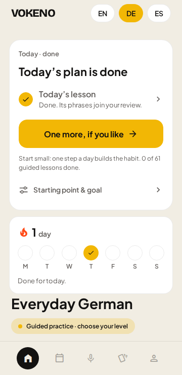

# Vokeno learner-experience review

Reviewed 8 October 2026 against commit `09f1af0`.

**Product priority confirmed by the owner: beginners learning for everyday life.**

**Decision:** improve the structure and continuity of the learning journey before expanding the navigation or adding more prominent features. Keep the visual identity and the useful lesson components. Give every learner one dependable next action, an understandable place in their course, and a clear stopping point.

The concern about confusion is supported by specific behavior in the app. However, Home already gives a new learner a prominent Start lesson button. The strongest problems appear when the learner leaves a lesson, completes an activity, takes placement, changes languages, or explores Learn. The app offers guidance, but that guidance does not consistently agree across these situations.

This is an expert review supported by source inspection, browser walkthroughs, and research. It establishes usability risks and reproducible defects; it does not establish how many real learners are confused or whether any particular change will increase retention.

## 1. What was examined

- Onboarding, learning preferences, placement, all three Home and Learn variants, navigation, listening, both guided lesson players, review, progress, and the speaking entry screen.
- Recommendation selection, lesson ordering, practice logs, completion records, milestones, review scheduling, language selection, and persisted learning state.
- Reading, writing, assessment, account, and settings flows in source, with particular attention to their entry and exit points.
- Existing curriculum and expansion plans, including the ongoing German unit conversion.
- Production web export with synthetic configuration, at 360 × 740 and 412 × 915 viewport sizes. External browser requests were blocked. The walkthrough included a complete German unit session, partial exit and resume, listening completion, placement, return after a break, and a new language after an established practice habit.
- Six existing test suites: daily plan, foundations, review, level status, placement, and milestones. All **55 tests passed**. They do not currently rule out the journey inconsistencies documented below.

No live AI call, real account operation, purchase, or deployment was performed. Native onboarding routing was inspected in code; web deliberately skips automatic onboarding, so its tour was opened explicitly. Native audio quality, TalkBack/VoiceOver, device font scaling, and actual learner behavior remain to be tested. This is not a comprehensive security, linguistic, or accessibility certification.

The required [Expo SDK 57 documentation](https://docs.expo.dev/versions/v57.0.0/) was read before writing the temporary audit scripts. Application source was not modified.

### The current content model

Counts were taken from the active catalogs, not older documentation. A guided “lesson” below means one independently playable session; four German sessions can belong to one unit.

| Track   | Active guided sessions | Difficulty labels      | Listening dialogues | Speaking catalog entries |
| ------- | ---------------------: | ---------------------- | ------------------: | -----------------------: |
| English |                     20 | A2: 3; B1: 12; B2: 5   |                   9 |                        6 |
| German  |                     61 | A1: 31; A2: 14; B1: 16 |                  11 |                        6 |
| Spanish |                     29 | A1: 15; A2: 14         |                  10 |                        6 |

German includes 24 newer step-based sessions in six units and 37 active classic lessons. Seven older German lessons are retired but preserved for history and review. English also has four separate reading activities. Speaking entries include exam destinations where configured; the count does not mean six beginner conversations.

Sources: [guided catalog](../src/features/foundations/catalog.ts), [listening catalog](../src/features/listening/scenarios.ts), [speaking catalog](../src/features/curriculum/catalog.ts), [reading catalog](../src/features/reading/catalog.ts).

The learner currently encounters several partially separate structures:

| Structure         | How it works now                                                                                     |
| ----------------- | ---------------------------------------------------------------------------------------------------- |
| Today             | Selects one to three activity types based on practice history; initially considers ability and goal. |
| Guided path       | Uses lesson order, unfinished state, and recent completion to choose a next lesson.                  |
| Lesson completion | Usually opens the next item in the guided catalog.                                                   |
| Speaking path     | Has its own situations and completion records.                                                       |
| Listening library | Shows dialogues and completion checks; completion returns to the library.                            |
| Review            | Schedules learned phrases; completion returns to Learn.                                              |
| Placement         | Recommends a starting activity without persisting that placement decision.                           |

These can be useful views of one journey. Currently, they also make independent decisions about that journey.

## 2. What should be preserved

The product has a useful base to build on:

- A prominent first action on Home and modest initial practice expectations.
- Saved guided-lesson position, writing drafts, and account-scoped learning records.
- Specific everyday outcomes, translated phrases, slow playback, retry feedback, and optional speaking rehearsal.
- The German unit format, which already groups related sessions around a practical outcome.
- Review sessions capped at eight distinct due phrases, with expanding review intervals.
- Language selection that generally follows the learner across primary destinations.
- Explicit starter-course limitations and separation between practice and certified attainment.
- Guest learning, contextual reminder opt-in, and a forgiving approach to missed days.

The initial Home button is visible on both tested viewport sizes. There was no document-level horizontal overflow in the captured normal-text states. The color palette, typography, cards, and large primary buttons can remain; visual replacement is not necessary to address the main findings.

## 3. Findings, ordered by impact

“High” means a problem directly affects the main learning journey or the learner's trust in progress. “Medium” means a discoverability, interpretation, or growth problem. These are review judgments, not measured abandonment rates.

### F1 — High: practice is being presented as completion

**Observed in the browser:** start the first German lesson, advance past its first teaching screen, close it, and return Home. Home says “Today’s plan is done” and “Done. Its phrases join your review,” while also displaying **0 of 61 guided lessons done**. The unfinished lesson is offered behind “One more, if you like.” The same mechanism applies to classic lessons.



**Cause:** both lesson players call `recordPractice('lesson', track)` during advancement. `buildTodayPlan()` uses the presence of that practice kind to mark its lesson step done. The phrase cards are actually seeded on completion. Review has a related problem: grading one card records the review kind, which can mark the day's review done before the session finishes. That review behavior was also reproduced after a synthetic six-day break.

Sources: [classic lesson advancement](../src/app/foundation/[id].tsx), [step lesson advancement](../src/components/step-lesson.tsx), [daily plan](../src/features/coaching/daily-plan.ts), [review grading](../src/app/review.tsx).

**Change:** represent activity participation and activity completion separately. It is reasonable to give someone credit for practising briefly. It is misleading to say their lesson is complete or its phrases are in review when neither is true. An unfinished required session should remain “Continue” with its saved position.

**Acceptance:** leaving after one teaching step or one review card preserves the unfinished session; no completion claim appears. A voluntary decision to stop early can still receive supportive acknowledgement.

### F2 — High: “what next?” depends on where the learner looks

**Observed:** choosing German and “I know some words and short phrases” makes Home recommend the café lesson in Unit 5. Learn still highlights the first lesson in Unit 1. Completing placement at secure A1 recommends an A2 lesson; opening it and leaving before advancing makes Home recommend Unit 1 again.

**Additional source finding:** for some English goals, setup recommends reading or writing. Today rejects recommendations outside the guided-lesson route and substitutes the guided path. These are different policies, not merely different button wording.

Sources: [setup recommendations](../src/features/coaching/recommendation.ts), [setup screen](../src/app/learning-plan.tsx), [Today selection](../src/features/coaching/daily-plan.ts), [Learn selection](../src/components/foundation-path.tsx), [placement state and result navigation](../src/app/placement.tsx).

**Change:** persist the learner's chosen starting position and the placement recommendation they accept. Use one shared journey decision for Home, the course highlight, progress, and completion screens. Course browsing should remain free; browsing a lesson should not silently replace the learner's chosen course position.

**Acceptance:** selecting or accepting a start point survives closing the screen and restarting the app. Every “Continue your course” action agrees on the same session.

### F3 — High: completed items do not reliably refer to the item completed

**Observed:** after completing the first German session, tapping the checked “Today’s lesson” row opens the second, unfinished session. The row's destination is computed from the current upcoming lesson, rather than the identity of the completed lesson. Speaking/listening plan rows can similarly be rebuilt from the next unpractised catalog item while their activity kind is marked done.

Sources: [doneLessonStep and other plan steps](../src/features/coaching/daily-plan.ts), [clickable Today rows](../src/components/learning-recommendation.tsx).

**Change:** bind plan entries and completion evidence to concrete activity IDs. Keep the completed title and destination stable. A checked row may open the completed activity's summary or a clearly labelled replay.

**Acceptance:** a checked item always opens the activity it names. Recalculation after completion cannot relabel an unfinished activity as done.

### F4 — High: activities have separate exits instead of a shared session ending

| Activity                   | Current main ending                                             |
| -------------------------- | --------------------------------------------------------------- |
| Guided lesson              | Next lesson, even if today's intended work is already finished. |
| Listening                  | More listening practice → library.                              |
| Review                     | Back to learning → long Learn page.                             |
| Reading                    | Next reading; the final reading cycles back to the first.       |
| Writing                    | Feedback or next writing task; progress is a secondary link.    |
| Ordinary live conversation | Start a new conversation after ending.                          |
| Spoken assessment          | Retake check is the principal result action.                    |

Sources: [guided player](../src/components/step-lesson.tsx), [listening player](../src/app/lesson/[id].tsx), [review](../src/app/review.tsx), [reading](../src/app/reading.tsx), [writing](../src/components/writing-activity.tsx), [conversation](../src/app/conversation.tsx), [assessment result](../src/app/assessment-result.tsx).

This makes continuing an activity easy, but does not consistently answer whether the learner should continue it, switch to another skill, or stop for today.

**Change:** give all activities a shared completion pattern: what was practised, what was saved, and the next relevant action. If a selected daily session has another step, name it. If it is finished, make “Done for today” the main action and show one named optional extra. Use task-specific results inside that common structure.

Retain source context: an activity opened from Today should return to today's sequence; a replay opened from the library should offer return to that library without altering course position.

### F5 — High for beginners: navigation depends on guessing icons

The actual bottom navigation in `voka-ui.tsx` has accessible names but no visible labels. A calendar represents the learning path and a stack of cards represents progress. A sighted beginner must learn those meanings. Screen-reader labels do not solve that visual recognition problem.

Source: [BottomNav](../src/components/voka-ui.tsx). The similarly named `app-tabs` files are unused starter components, not the active navigation. [Earlier project notes](gap-closure-plan.md) say visible labels were removed at the owner's request; this review recommends revisiting that choice, without silently changing it.

**Change:** add persistent, short text labels. This follows the evidence that most icons need labels to disambiguate their meaning. [NN/g: Icon Usability](https://www.nngroup.com/articles/icon-usability/).

Use “Today,” “Course,” “Practice,” and “Progress” in the proposed structure below. An immediate smaller change can label the existing five destinations first; changing the destination count is a separate design decision.

### F6 — High for growth: Learn exposes the catalog before it organizes the journey

The selected level is a fully expanded list, followed by practice tools and another speaking path. The newer German unit headings help, but do not collapse the sessions beneath them.

| Fresh Learn screen, 360 × 740 viewport | Scroll content | Visible scroll area | Approximate screenfuls |
| -------------------------------------- | -------------: | ------------------: | ---------------------: |
| German, A1 selected                    |       7,306 px |              673 px |                   10.9 |
| Spanish, A1 selected                   |       4,073 px |              673 px |                    6.1 |
| English, A2 selected                   |       3,016 px |              673 px |                    4.5 |

German's Practice tools begin with Review at approximately **y = 5,389 px**, about eight scroll-view heights below the top. These are measurements of the browser preview, not native-device measurements or universal page-length limits. Long scrolling is not inherently bad; burying a different core task beneath a growing catalog creates the risk here.

Sources: [Learn composition](../src/app/sprint.tsx), [expanded level list](../src/components/foundation-path.tsx).

**Change:** keep the current unit open, summarize other units, and give practice tools their own predictable destination. Level/course selection belongs in a secondary picker. Include an explicit “Browse all lessons” route for learners who want it.

This applies progressive disclosure: keep frequent, important actions visible and reveal specialized detail when requested. The secondary route must remain easy to find. [NN/g: Progressive Disclosure](https://www.nngroup.com/articles/progressive-disclosure/).

### F7 — High for the chosen audience: difficulty and prerequisites are not consistent at entry

English's zero-experience recommendation opens an A2-labelled phonology lesson with phonetic symbols, stress patterns, and English explanations. The repository's curriculum plan describes English's intended direction as B1–C1 fluency and IELTS. That can be a legitimate track, but it conflicts with offering the same “starting from zero” promise as German and Spanish.

The generic speaking tab opens B1–C1 interview English or A2–B2 German; it does not automatically open the beginner situation associated with the current lesson. Spanish's generic mode is A1. Unit-specific conversation links can be better matched, so the problem is partly the entry route.

Sources: [English content](../src/features/foundations/english-lessons.ts), [recommendations](../src/features/coaching/recommendation.ts), [conversation modes](../src/features/conversation/modes.ts), [curriculum direction](curriculum-standards-audit.md).

**Change:** lead with what the learner will do: “Say hello and introduce yourself,” followed by a plain difficulty description. Use CEFR as supporting metadata. Choose speaking situations from the learner's actual course context. Offer a short example and optional rehearsal before an open call.

For English, decide explicitly between a real beginner curriculum and a track for learners who already know the basics. Given the existing roadmap, the immediate recommendation is to label the current track honestly and stop presenting it as a complete zero-to-English entry point. A navigation redesign cannot supply missing teaching content.

The app also assumes English comprehension for instructions and explanations. Adding target languages does not automatically make it accessible to learners with other support languages. State the teaching language clearly; treat interface/support language as a separate future capability.

### F8 — Medium–high: a new language inherits an experienced daily workload

The practice stage uses days across all languages. In a synthetic history with 15 German practice days and no Spanish progress, first-time Spanish Home offered three steps. On the audit date it put speaking before the first lesson and said the learner had an established routine.

Source: [global practice stage](../src/features/habits/practice-log.ts), [useHabits](../src/features/habits/use-habits.ts), [plan ordering](../src/features/coaching/daily-plan.ts).

**Change:** keep an overall habit streak if desired, but determine instructional readiness and new-language onboarding per language. Let learners choose their time commitment and shorten today's work. Do not automatically equate more active days with readiness for more work or speaking first.

A day-of-calendar alternation between speaking and listening provides variety, but does not establish pedagogical relevance. Prefer an activity related to the current unit and already introduced material.

### F9 — Medium: Home and Progress communicate several competing models of progress

Home combines Today, a weekly streak, whole-catalog completion, and language-specific feature cards. German additionally shows another speaking sequence with its own “NEXT.” English gives listening a separate prominent completion card. Progress displays three language totals, global writing/speaking days, selected-language speaking counts, review, and a next step near the bottom.

Sources: [Home](../src/app/index.tsx), [Progress](../src/app/progress.tsx), [streak copy](../src/components/streak-strip.tsx).

The streak can say “Done for today” after activity participation while Today still contains unfinished work. Whole-catalog denominators also grow as content is added, making apparent progress smaller without the learner losing any learning.

**Change:** distinguish today's chosen session, the current unit, the course, and the overall habit. Lead Progress with the selected language and meaningful evidence of learning. Keep total counts and other languages behind details. Say “You practised today” for the streak; reserve “Today's plan complete” for the plan.

### F10 — Medium: course growth needs stable learning identities

Some foundations for safe growth already exist: stable lesson IDs and retired lessons retained in history. However, ordering is still mostly catalog-array order; phrase review is indexed by phrase position; the latest lesson attempt influences the next lesson; and placement/enrollment is not a durable course position.

Sources: [catalog](../src/features/foundations/catalog.ts), [next lesson](../src/features/foundations/next.ts), [review card identity](../src/features/review/schedule.ts), [foundation progress](../src/features/foundations/progress.ts).

**Risks inferred from those structures:** inserting lessons before an established position can delay their recommendation; changing phrase order can attach existing review history to different phrases; changing a lesson's steps can make a saved numeric step mean something different. These are change-management risks, not claims that data corruption was observed in this audit.

**Change:** use explicit course/unit membership and order, stable activity and review-item IDs, content versions, and defined migration rules. Preserve earned completion when publishing additions. Introduce new content as an addition or targeted recommendation. Distinguish replays from forward course progression.

On completing all published lessons, show “You have finished the available lessons” and appropriate review/practice. Currently Home has a practice fallback, while Learn's next-lesson selector falls back to the first lesson. Make that distinction explicit instead of implying the course simply restarts.

### F11 — Medium: several small UI and copy issues reinforce uncertainty

- Spanish placement exists in Learn, but setup hides the placement option specifically for Spanish.
- Learn still describes Spanish listening as A1 despite A2 dialogues in the catalog.
- The daily plan assigns every guided lesson five minutes even though newer sessions carry individual durations, including seven minutes.
- “Nothing to review yet” is also shown when phrases already exist but none are due. Use “All caught up” for that state.
- “Just before you would forget” overstates a fixed-interval review scheduler. Prefer “Scheduled practice helps you remember these phrases.” Spacing and retrieval have research support; this exact prediction and schedule have not been validated for Vokeno. [IES practice guide](https://ies.ed.gov/ncee/wwc/PracticeGuide/1).
- Milestones say “You can now” based on activity completion. Prefer “You practised…” until performance on varied tasks supports the stronger claim.
- Guest data isolation is useful, but the onboarding warning that guest progress is separate should also be clear where someone chooses to create or enter an account. “Sign in to sync your progress” can otherwise imply that this particular guest history will transfer. Any future transfer needs an explicit, account-safe design.

Sources: [setup](../src/app/learning-plan.tsx), [Learn](../src/app/sprint.tsx), [Today](../src/features/coaching/daily-plan.ts), [review](../src/app/review.tsx), [milestones UI](../src/components/learning-recommendation.tsx), [onboarding](../src/app/onboarding.tsx), [profile](../src/app/profile.tsx).

### F12 — Medium: contrast and touch sizing need a focused pass

Computed from source colors:

| Element                                             | Contrast | Implication                                               |
| --------------------------------------------------- | -------: | --------------------------------------------------------- |
| Unselected, enabled light-navigation icons on cream |   2.22:1 | Below the 3:1 benchmark for meaningful non-text controls. |
| German speaking “NEXT,” yellow on white             |   1.82:1 | Below the 4.5:1 requirement for this small text.          |
| Spanish live-start text, ink on violet              |   3.06:1 | Below the 4.5:1 requirement for normal-size text.         |

The shared language palette already provides white `onAccent` for Spanish; the conversation button should use it. Most large primary controls are generous. Some back controls are 40 units and language chips are 36 high with hit slop; audit actual hit areas rather than treating visual size alone as the target.

Use [WCAG text contrast](https://www.w3.org/WAI/WCAG22/Understanding/contrast-minimum.html) and [non-text contrast](https://www.w3.org/WAI/WCAG22/Understanding/non-text-contrast.html) as checks. For native Android, target at least 48 dp touch areas as recommended by [Android accessibility guidance](https://support.google.com/accessibility/android/answer/7101858?hl=en). WCAG 2.2's web AA target-size minimum is 24 CSS pixels with exceptions; it is not the same rule as Android's recommendation. [WCAG target size](https://www.w3.org/WAI/WCAG22/Understanding/target-size-minimum.html).

## 4. The recommended product structure

The working principle is: **the app selects a sensible next step; the learner can understand and change it.**

This supports visibility of state, consistency, recognition, and user control. These are established usability principles, rather than a requirement to imitate the newest visual trend. [Nielsen's usability heuristics](https://www.nngroup.com/articles/ten-usability-heuristics/).

### Four labelled destinations

| Destination | Learner question              | Main content                                                                                   |
| ----------- | ----------------------------- | ---------------------------------------------------------------------------------------------- |
| Today       | What should I do now?         | Resume or start one named activity; small daily-session context; an honest finished state.     |
| Course      | Where am I going?             | Current unit, upcoming unit summaries, completed units, and deliberate browsing.               |
| Practice    | What would I like to work on? | Due review, lesson-related listening/speaking, then skill/topic browsing.                      |
| Progress    | What have I learned?          | Current-language unit progress, practice evidence, review history, and optional habit details. |

Put profile and settings behind a recognisable avatar/account control. Keep speaking easy to reach as a top Practice action and a contextual lesson action. If observed usage later justifies a dedicated speaking tab, it can remain; four destinations are a proposed fit for this product, not a universal UX rule.

Use the same structure for every language, with content and supported capabilities supplied by data. Replace the growing row of language chips with an active-language control such as “German ▾.” Its picker should show full language names, recently used languages, and each language's saved position. Add search when the list warrants it. Avoid flags as language identifiers.

### Today: enough information to choose confidently

Illustrative layout, not an implemented screen:

```text
German ▾                                      Account
Today

Unit 1 · Meeting people
Say your name and ask someone theirs
Lesson 2 of 4 · about 5 minutes

[ Continue lesson ]

Your session: 1 of 2 activities complete
After this: a short review of familiar phrases

View course                         Change today's plan
You practised on 3 days this week
```

Use a genuine remaining-time estimate only when the app has one; otherwise show the lesson's approximate total duration. Do not add all library links, advanced settings, and all-language statistics underneath this card. Practice remains discoverable through its labelled destination.

For a first-time learner, the main card becomes “Your first lesson: say hello.” For someone resuming, it names the unfinished lesson. After a break, offer a small restart without a large backlog. After the chosen work is complete, give a visible finish and an optional next lesson with its title.

### Course: practical units and local progress

Use the hierarchy **language → course/section → practical unit → lesson session**. The interface need not expose every layer at once. CEFR metadata describes difficulty/coverage; it should not replace plain-language outcomes.

```text
German · Everyday beginnings

▾ Unit 1 · Meet someone                   1 of 4 done
  ✓ Say hello and goodbye
  → Say your name                         Continue
  ○ Ask for repetition
  ○ Use it in a short exchange

▸ Unit 2 · Say where you are from
▸ Unit 3 · Numbers in everyday life

Browse units                            Change starting point
```

These are illustrative labels, not a claim that the current unit has precisely this sequence. Map the authored lessons carefully; the current German units include exam-task sessions. For an everyday learner, frame applicable tasks by their real use, such as names and forms, and put optional exam-specific practice in the exam area.

Expand the current unit automatically and remember deliberate expansion elsewhere. Show text states such as Current, Completed, and Available. Allow review and browsing; do not add artificial locks simply to force retention. Where knowledge is helpful, explain a recommended prerequisite and let the learner choose a refresher.

When all currently published material is finished, retain completion and describe the available next options. Do not turn unpublished units into a long disabled checklist.

### Completion: connect learning and stopping

```text
You practised introducing yourself
Your lesson is saved.

Today's session: complete
These phrases are scheduled for review tomorrow.

[ Done for today ]
Optional: ask someone where they are from · 5 min
```

If another required activity remains, replace the main action with its name, for example “Review 5 phrases · about 3 min,” and keep a secondary “Finish for now.” A choice to finish early is a legitimate stopping point, with unfinished work saved. It should not silently mark that work complete.

Show first-try scores as supporting evidence, not the only celebration. After a conversation, briefly explain what was practised and offer the next relevant course action. When a microphone, connection, allowance, or audio voice is unavailable, offer a relevant available activity and preserve the learner's place.

### Onboarding: reach a useful exchange quickly

1. Choose the learning language and clearly state the language used for explanations.
2. Choose “I'm new” or “I know some.” Offer optional placement for those who want it, consistently across supported languages.
3. Show a named first lesson and what the learner will practise; begin it directly.
4. Offer a manageable schedule and optional reminder after the first useful success. Keep a five-minute starting default, adjustable by the learner.

Keep the existing tour available as help. Reduce dependence on remembering its promises later. A beginner should not have to choose an accent, exam variant, pronunciation target, and skill library before experiencing a useful lesson.

Clear page purpose and orientation also help people with cognitive and learning disabilities. This is supported by [W3C cognitive-accessibility guidance](https://www.w3.org/WAI/WCAG2/supplemental/patterns/o1p01-clear-purpose/), which is supplemental design guidance, not itself an additional WCAG conformance requirement.

### One explicit policy for choosing the next activity

The shared recommendation needs understandable rules, not simply a new card component:

1. **Resume:** offer the learner's active unfinished session in this language, including the current review session. If there are several drafts, use the explicitly active session or most recently worked-on session, rather than the first unfinished item in catalog order. A returning learner may choose a short refresher instead.
2. **Continue the selected daily session:** use its remaining activity IDs and order. Keep this list stable during the session; any change in time budget or activity should be an understandable learner choice. Store what was actually completed.
3. **Build a new small session:** start from the accepted course position and chosen time budget. For an absolute beginner, teach a useful exchange first. On later days, a short due review can come first; add the next lesson or a related use-it activity when the learner's selected session allows it. Do not insert an entire review backlog.
4. **Match practice to what was taught:** select listening/speaking by unit, prerequisites, and availability. Offer a suitable alternative when speaking is impractical. Live AI access should not become an unavoidable dependency for finishing the basic learning session.
5. **Finish visibly:** when the selected work is complete, display the stopping state. Offer the next named activity as optional; do not silently add it to today's requirements.

Keep the chosen course position independent of review and optional browsing. A “Skip ahead” or accepted placement decision can deliberately change it; repeating an earlier lesson should not. Recommendations should explain their reason in one line, such as “This uses the greetings you just learned.”

These rules are the proposed starting policy. Educators should validate the ordering of taught material and related practice; usability testing should validate whether learners understand the policy's visible results.

## 5. What the competitor evidence supports

This comparison uses providers' published design explanations and help documentation, not hands-on claims about every variant of their current apps. Historical design articles remain useful rationale but are not proof of a causal retention gain in Vokeno.

| Evidence                                                                                                                         | Useful lesson for Vokeno                                                 | Limit                                                                                                                                                                                                        |
| -------------------------------------------------------------------------------------------------------------------------------- | ------------------------------------------------------------------------ | ------------------------------------------------------------------------------------------------------------------------------------------------------------------------------------------------------------ |
| Duolingo describes integrating new lessons, stories, and review into a guided sequence.                                          | Include review and relevant skill practice in a coherent learning route. | It does not establish that Vokeno needs a winding map, hard gates, or Duolingo's reward system. [Duolingo design explanation](https://blog.duolingo.com/new-duolingo-home-screen-design/).                   |
| Babbel describes smaller units organised by practical learning objectives and consistent learning-path decisions across clients. | Group around useful outcomes and keep continuation consistent.           | Its service architecture and subscription model are not necessary for this app. [Babbel's unit redesign](https://www.babbel.com/en/magazine/from-old-school-structure-to-learning-for-real-life-situations). |
| Babbel's help documents course/lesson switching and repetition.                                                                  | Preserve learner choice alongside the recommended route.                 | Guidance does not require preventing exploration. [Babbel course navigation](https://support.babbel.com/hc/en-gb/articles/205600458-Change-or-repeat-a-course-or-lesson).                                    |

The proposal is therefore a guided everyday course with optional exploration. Retain autonomy, relevant review, and practical speaking; simplify the decisions needed before learning.

## 6. Implementation order

### First: make the existing guidance trustworthy

- Separate practice participation, session completion, and mastery evidence.
- Give daily-plan entries stable IDs and preserve the actual completed activity.
- Persist accepted starting points and unify continuation across Today, Course, and results.
- Fix partial-exit/resume, placement persistence, misleading done-row destinations, and per-language starting workload.
- Add visible navigation labels and correct the identified contrast/copy issues.

This work has the highest immediate value even before a screen redesign. Keep it independently reviewable and test the journey transitions, not only isolated selectors.

### Next: restructure the surfaces

- Prototype Today, Course, Practice, and common completion states.
- Run an initial beginner usability round before committing to the entire navigation change.
- Implement the current-unit view and predictable practice destination.
- Make Home's layout consistent across languages and replace duplicated next-step cards.
- Introduce the scalable language picker and selected-language progress summary.

### Then: make expansion safe and pedagogically coherent

Use a shared content registry containing stable IDs, target/support language, course/unit membership, order, practical outcome, prerequisites where justified, skill/type, duration, online/microphone requirements, publication state, and content version. Reuse the present catalogs and extend them incrementally; a new CMS or backend rewrite is not required just to reorganise the UI.

Store a course position per learner and language separately from attempt history. Keep review-item identity stable when text changes. Define mappings for retired/replaced activities and behavior when new units appear. Derive advertised counts and capability descriptions from the catalog so copy cannot drift as easily.

Extend the existing German unit pattern to the rest of German and Spanish, with educator review of sequencing. Resolve the English audience promise explicitly. Connected listening, writing, and speaking activities should draw on the unit's taught language rather than being selected only by broad CEFR rank.

Spacing and retrieval are supported teaching practices, but neither an exact 1/3/7-day schedule nor a one/two/three-step workload should be described as proven optimal for these learners. Validate those choices through learning evidence and use. [IES: Organizing Instruction and Study](https://ies.ed.gov/ncee/wwc/PracticeGuide/1).

## 7. States the redesign must handle

| State                                 | Expected learner experience                                                             |
| ------------------------------------- | --------------------------------------------------------------------------------------- |
| First visit                           | One suitable starter lesson and a plain outcome.                                        |
| Lesson partly completed               | Resume the same session at its saved step.                                              |
| Placement accepted, no lesson started | Keep the accepted start point.                                                          |
| One planned activity finished         | Preserve that activity's identity; name the next one.                                   |
| Daily session finished                | Clear stopping action and one named optional extra.                                     |
| Returned after a break                | Manageable restart; progress intact; backlog not presented as debt.                     |
| Established habit, new language       | Beginner treatment for the new language with prior-language progress preserved.         |
| Optional replay                       | Credit practice without moving the course position backwards or skipping required work. |
| Offline or microphone unavailable     | Relevant available fallback and retained plan position.                                 |
| Published course exhausted            | Completion retained; review/practice available; new content described honestly.         |
| New or revised content published      | Stable earned progress and defined content migration.                                   |
| Account/session changes               | Clear account-specific progress and explicit expectations for guest history.            |

## 8. How to establish whether the redesign works

Start with a moderated round of six to eight intended beginner learners, including people with lower app confidence and relevant support-language needs. Include German and Spanish entry journeys; evaluate English's prerequisite messaging separately. Repeat after changes. This provides directional usability evidence, not a statistically representative retention estimate.

Ask learners to choose a starting activity, leave halfway and resume, finish one lesson and decide what to do next, find review, return after several days, and switch languages. Observe the first action before explaining the screen. Afterwards ask what the completion checks and progress labels mean. Native screen-reader and larger-text checks need their own sessions.

Provisional targets for the next round, to calibrate against a baseline:

- At least 80% independently identify a suitable first action within 10 seconds of seeing Today.
- At least 80% identify the next action after completion without moderator help.
- No observed false-completion or wrong-resume transitions in the tested flows.
- Learners can explain the difference between a completed lesson, today's session, and course progress.
- No critical controls obscured on the supported compact screen, with larger text and assistive technology checks included before release.

Instrument activity identity, start/resume/completion, plan completion, route context, and language switching. Measure time to first meaningful completion, first-session completion, successful resumption, voluntary return after breaks, and week-one retention by language/start level. Pair these with delayed checks on familiar and unseen tasks; more time in the app alone is not educational success.

Use minimal event metadata rather than raw learner writing or conversations for navigation analytics. Account for new content, acquisition changes, and language mix when comparing retention. If there is enough traffic, compare a defined change against the existing journey; otherwise combine repeated usability work with cautious cohort observation.

The objective is a learner who returns because the next useful step is obvious, the work feels achievable, and progress is believable.

## 9. Verification and review assets

- Browser walkthroughs and source checks reproduced F1–F3; the review exit case in F1 and the language-history case in F8 used synthetic saved state.
- Both Home and Learn were captured in all three languages at both viewport sizes. German lesson completion, listening completion, placement, and the additional state scenarios were exercised without external requests.
- The targeted existing Jest run passed 6 suites / 55 tests. No full release gate was run because no application code changed.
- Temporary scripts, detailed captures, and catalog summaries were kept in `/tmp/vokeno-ux-audit`, with runners `/tmp/vokeno-ux-browser.cjs` and `/tmp/vokeno-ux-data.cjs`. Selected screenshots are retained beside this report.

```bash
npm run test:ci -- --runTestsByPath \
  tests/daily-plan.test.ts tests/foundations.test.ts tests/review.test.ts \
  tests/level-status.test.ts tests/placement.test.ts tests/milestones.test.ts
```

Selected evidence:

- [Fresh German Home](ux-review-2026-10/home-new.png): the main first action is already visible.
- [German Learn](ux-review-2026-10/course-new.png): current course and level framing before the expanded list.
- [Home after partial lesson](ux-review-2026-10/home-partial.png): plan completion contradicts zero completed lessons.
- [Completed session](ux-review-2026-10/lesson-complete.png): next lesson is the primary exit.
- [First Spanish visit after German practice history](ux-review-2026-10/language-switch.png): a new language inherits a three-step session.
